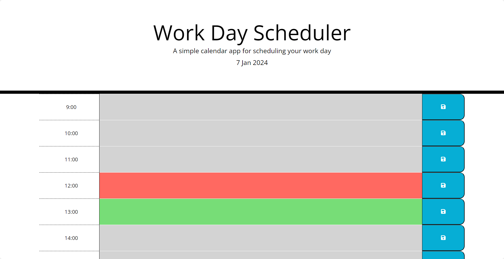

# Daily Planner

## Overview

Welcome to the Daily Planner App! This simple and intuitive application is designed to help you organize your daily tasks and events efficiently.




## Deployment

The deployed version can be accessed [here](https://borregaio.github.io/daily-planner-app/).


## Technologies Used
- JavaScript
- jQuery
- jQuery UI
- Day.js


## Features

**Display the Current Day:**
When you open the planner, the current day is prominently displayed at the top of the calendar, providing you with instant awareness of today's date.

**Timeblocks for Standard Business Hours:**
As you scroll down, the planner presents timeblocks for standard business hours, allowing you to schedule your tasks and events throughout the day easily.

**Color-coded Timeblocks:**
Each timeblock is color-coded to indicate whether it represents the past, present, or future. This visual cue helps you quickly identify and prioritize your tasks.
- Past: Gray
- Present: Red
- Future: Green

**Event Entry:**
Click on any timeblock to enter an event. A text area will appear, enabling you to input and save your task or event for that specific time.

**Save to Local Storage:**
When you've entered your event, click the save button within the timeblock to store the information in your browser's local storage. This ensures that your events persist even if you refresh the page or close the browser.

**Persistent Events:**
The app is designed to persist events between refreshes of the page. Your schedule remains intact, providing a seamless and uninterrupted planning experience.


## Getting Started

1. Clone the repository
    ```console
    git clone https://github.com/borregaio/daily-planner-app.git
    ```

2. Open the index.html file in a web browser
    ```console
    cd daily-planner-app
    open index.html
    ```

3. Start planning your day by entering events in the timeblocks and saving them.


## Steps Followed

**Display the Current Day**
```javascript
var today = dayjs();
$('#currentDay').text(today.format("D MMM YYYY"));
```

**Timeblocks for Standard Business Hours**
```javascript
var hours = ['9:00', '10:00', '11:00', '12:00', '13:00', '14:00', '15:00', '16:00', '17:00', '18:00', '19:00'];

for (var i = 0; i < hours.length; i++) {

    var container = $('.container');
    var timeBlock = $('<div>').addClass('time-block');
    var hour = $('<div>').addClass('hour').text(hours[i]);
    var textarea = $('<textarea>').addClass('row');
    var saveBtn = $('<button>').addClass('saveBtn').html('<i class="fa-solid fa-floppy-disk"></i>');

    // Append hour, textarea, and save button to the timeblock
    timeBlock.append(hour, textarea, saveBtn);

    // Append the timeblock to the container
    container.append(timeBlock);
```

**Color-coded Timeblocks**
```javascript
    //Add colours to each time- block according to real time
    var currentHour = dayjs().hour();

    if (parseInt(hours[i]) === currentHour) {
        textarea.addClass('present');
    } else if (parseInt(hours[i]) === currentHour + 1) {
        textarea.addClass('future');
    } else {
        textarea.addClass('past');
    }

```

**Save to Local Storage**
```javascript
    // Add event handler for the save button click
    saveBtn.on('click', function () {
        var savedText = $(this).siblings('textarea').val();
        console.log(savedText);

        // Get the corresponding hour for the saved text
        var savedHour = $(this).siblings('.hour').text();
        console.log(savedHour);

        // Save the text to local storage using the hour as a key
        localStorage.setItem(savedHour, savedText);
    });
```

**Persistent Events**
```javascript
    // Load saved text from local storage and set it to the corresponding textarea
    var savedText = localStorage.getItem(hours[i]);
    if (savedText) {
        textarea.val(savedText);
    }
}
```